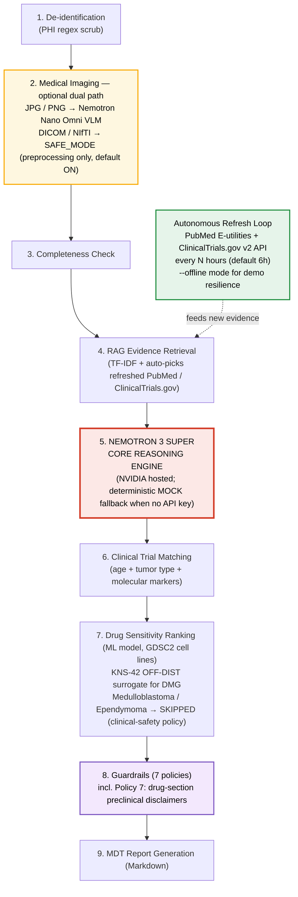

# Pediatric Neuro-Oncology Surgical Planning Agent

A runnable hackathon project for an autonomous long-agent workflow for pediatric neuro-oncology pre-operative MDT planning.

## Architecture



> Static high-resolution version: [`assets/architecture.png`](assets/architecture.png)

## Core design

Nemotron 3 Super is the core clinical reasoning model. Other modules are upstream tools:

- `image_analysis.py`: optional JPG/PNG image-to-text using NVIDIA OpenAI-compatible VLM endpoint.
- `advanced_medical_imaging.py`: optional DICOM/NIfTI research-prototype advanced imaging module.
- `drug_ranking_adapter.py`: optional preclinical drug-ranking appendix adapter.
- `literature_trial_updater.py`: autonomous PubMed / ClinicalTrials.gov evidence refresh.
- `guardrails.py`: policy-based medical safety checks.

## Safety scope

This repository is a research prototype for hackathon demonstration. It does not provide a definitive diagnosis, prescription, or operative plan. All outputs require independent review by radiology, neurosurgery, pediatric neuro-oncology, pharmacy, and the MDT.

## Quick start in Colab

Upload this zip in Step 1 of the notebook. The notebook looks for a file matching:

```python
/content/*pediatric-neuro-oncology-agent*.zip
```

Then it extracts to:

```text
/content/pediatric-neuro-oncology-agent
```

## Local quick start

```bash
pip install -r requirements.txt
python agent/run_demo.py sample_cases/case_003_diffuse_midline_glioma.txt
```

Without `NVIDIA_API_KEY`, the project runs in MOCK mode. With an API key:

```bash
export NVIDIA_API_KEY="nvapi-..."
export NEMOTRON_MODEL="nvidia/nemotron-3-super-120b-a12b"
python agent/run_demo.py sample_cases/case_003_diffuse_midline_glioma.txt
```

## DICOM / NIfTI advanced imaging

```bash
python agent/run_demo.py sample_cases/case_003_diffuse_midline_glioma.txt --medical-study medical_inputs/my_study_or_nii
```

Or directly:

```bash
python tools/advanced_medical_imaging.py medical_inputs/my_study_or_nii --output-dir outputs
```

The segmentation and anatomic landmarks are heuristic placeholders, not validated clinical models. Replace with MONAI/nnUNet/atlas registration before any formal research use.

## Autonomous refresh loop

```bash
python tools/autonomous_refresh_loop.py --once
# or persistent
python tools/autonomous_refresh_loop.py --interval-hours 6
```

This refreshes PubMed / ClinicalTrials.gov evidence sources and then runs the agent watcher.

## Hackathon fit

The workflow supports autonomous operation, Nemotron core reasoning, real tasks (retrieval, automation, analysis, orchestration, reporting), deployability in Colab/local/cloud, and policy-based guardrails.

## Data provenance — drug-ranking cell lines

The preclinical drug-ranking module (`tools/drug_ranking_adapter.py`) is backed by 81 cell lines from the GDSC2 panel exposed by [otonifrio2812/pediatric-bt-drug-prediction](https://github.com/otonifrio2812/pediatric-bt-drug-prediction). It covers exactly 3 cancer types: **Glioblastoma (36)**, **Neuroblastoma (31)**, **Glioma (14)**.

All 50 Glioma + Glioblastoma cell-line identities were cross-checked against [Cellosaurus](https://www.cellosaurus.org) on 2026-05-27. Key findings drive the selection logic:

- **KNS-42 (SIDM00607, CVCL_0378)** is the **only confirmed pediatric CNS cell line in the model** (16 y/o male, anaplastic astrocytoma). It is hard-preferred as the surrogate for DMG / DIPG / H3K27M / pediatric pontine-glioma cases, always tagged **OFF-DISTRIBUTION** because no DIPG-specific line exists.
- All other 49 Glioma/GBM lines are adult-derived. Pediatric-glioma predictions are therefore labelled as **surrogate / hypothesis-generation only**, never as patient-specific predictions.
- **D-263MG (SIDM00732, CVCL_1154)** is **excluded** from the prediction pool. Cellosaurus flags it as "Possibly misidentified" (sex-chromosome discrepancy). The remaining 35 GBM lines provide ample coverage.
- All 31 Neuroblastoma lines are pediatric by tumor biology; KELLY (SIDM01009) is used as the MYCN-amplified reference cell line.

Tumor types **not covered by the model** (medulloblastoma, ependymoma) are explicitly skipped via `status="cancer_type_not_in_model"` rather than falling back to an unrelated cancer type — mapping MB or EP to Glioma would generate misleading rankings and is a clinical-safety red line.

Bigner-lab naming convention (Duke series): `D-XXX-MG` = malignant **G**lioma; `D-XXX-Med` = **Med**ulloblastoma. The model contains only `-MG` lines.

Dev introspection:

```bash
python tools/drug_ranking_adapter.py --setup       # clone repo + download artifacts to external/
python tools/drug_ranking_adapter.py --list-cells  # list all cells with tags (PEDIATRIC, EXCLUDED, etc.)
python tools/drug_ranking_adapter.py --demo        # run a DMG demo prediction
```
