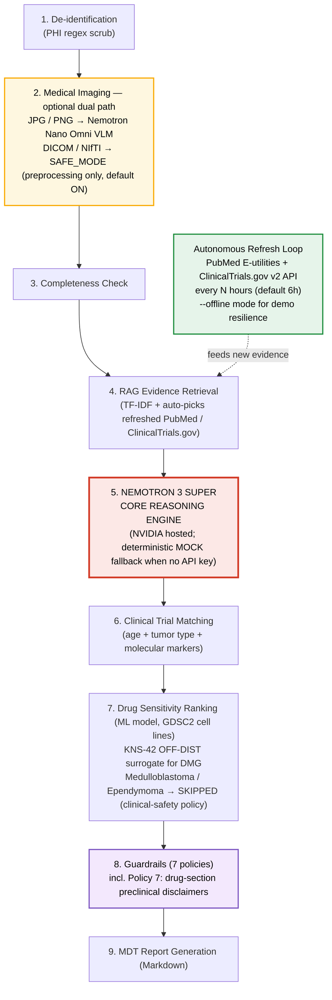

# Pediatric Neuro-Oncology Surgical Planning Agent

A runnable hackathon project for an autonomous long-agent workflow for pediatric neuro-oncology pre-operative MDT planning.

## Architecture



> Static high-resolution version: [`assets/architecture.png`](assets/architecture.png)

## What's in this agent

- **9-step autonomous pipeline** orchestrated end-to-end without human intervention.
- **NVIDIA models used:**
  - `nvidia/nemotron-3-super-120b-a12b` — core clinical text reasoning (Step 5 of the pipeline).
  - `nvidia/nemotron-3-nano-omni-30b-a3b-reasoning` — optional vision-language model for JPG/PNG imaging input (Step 2).
- **Safety-first surrogate logic** for the drug-ranking ML model: DMG / H3K27M cases use KNS-42 with an explicit OFF-DISTRIBUTION warning; medulloblastoma / ependymoma cases are explicitly **skipped** (no fallback to an unrelated cell line — clinical-safety policy).
- **7 medical guardrail policies** (PHI scrub, no definitive diagnosis, no prescription orders, imaging disclaimer, evidence disclosure, high-risk anatomy flags, drug-section preclinical disclaimer).
- **Autonomous evidence refresh** from PubMed + ClinicalTrials.gov, flowing into RAG automatically.
- **Demo-resilient by design:** runs without an API key (MOCK Nemotron fallback), without network (`--offline` mode), and without the drug model artifacts (graceful "artifacts unavailable" message — the rest of the pipeline still completes).

## Core design

Nemotron 3 Super is the core clinical reasoning model. Other modules are upstream tools:

- `image_analysis.py`: optional JPG/PNG image-to-text using NVIDIA OpenAI-compatible VLM endpoint.
- `advanced_medical_imaging.py`: optional DICOM/NIfTI research-prototype advanced imaging module.
- `drug_ranking_adapter.py`: optional preclinical drug-ranking appendix adapter.
- `literature_trial_updater.py`: autonomous PubMed / ClinicalTrials.gov evidence refresh.
- `guardrails.py`: policy-based medical safety checks.

## Safety scope

This repository is a research prototype for hackathon demonstration. It does not provide a definitive diagnosis, prescription, or operative plan. All outputs require independent review by radiology, neurosurgery, pediatric neuro-oncology, pharmacy, and the MDT.

## Quick start in Colab

Upload this zip in Step 1 of the notebook. The notebook looks for a file matching:

```python
/content/*pediatric-neuro-oncology-agent*.zip
```

Then it extracts to:

```text
/content/pediatric-neuro-oncology-agent
```

## 5-minute quick start (no API key, no setup required)

This project ships with a MOCK Nemotron fallback, so the pipeline always runs end-to-end — no credentials, no model artifacts, no network needed for the baseline demo.

```bash
git clone https://github.com/otonifrio2812/pediatric-neuro-oncology-agent.git
cd pediatric-neuro-oncology-agent
pip install -r requirements.txt
python agent/run_demo.py sample_cases/case_003_diffuse_midline_glioma.txt
```

**What you'll see** (console tail):

```
Reasoning mode: MOCK Nemotron (nvidia/nemotron-3-super-120b-a12b)
Report written: outputs/case_report_<timestamp>.md

# Pediatric Neuro-Oncology Surgical Planning MDT Report
...
```

The console previews the first ~4000 chars of the generated MDT report. The full report is in `outputs/case_report_<timestamp>.md` and contains 8 numbered sections + a "Preclinical Drug Ranking" appendix (showing a graceful "unavailable" message until you run the optional drug setup — see below) + an "Agent Architecture" appendix.

> `Reasoning mode: MOCK Nemotron (...)` is **intentional** when `NVIDIA_API_KEY` is not set — the deterministic mock fallback is what makes the demo always work. Set the API key (next section) to swap in the live Nemotron endpoint.

### Two sample cases bundled

| Case file | Tumor | What it exercises |
|---|---|---|
| `sample_cases/case_003_diffuse_midline_glioma.txt` | DMG (H3 K27M, pons, age 8) | Drug ranking → KNS-42 surrogate with **OFF-DISTRIBUTION** warning |
| `sample_cases/demo_case_medulloblastoma.json` | Medulloblastoma (vermis, age 6) | Drug ranking **skipped** — clinical-safety policy (no MB cell line in the model) |

Both `.txt` (narrative) and `.json` (structured) case files are accepted by `run_demo.py`.

## Optional: enable the real NVIDIA Nemotron API

```bash
export NVIDIA_API_KEY="nvapi-..."
export NEMOTRON_MODEL="nvidia/nemotron-3-super-120b-a12b"   # default
python agent/run_demo.py sample_cases/case_003_diffuse_midline_glioma.txt
```

With a key, Step 5 of the pipeline calls the NVIDIA-hosted Nemotron endpoint. Without one, the MOCK reasoner runs and still produces a well-formed report — both paths exercise the full 9-step pipeline.

## Optional: enable drug-sensitivity ranking (ML model)

The drug-ranking module is **opt-in** and needs a one-time setup to clone the external model repo and download artifacts (~5 MB total). The `external/` folder is intentionally **not** committed to this repo (model files belong in their own [pediatric-bt-drug-prediction](https://github.com/otonifrio2812/pediatric-bt-drug-prediction) repo).

```bash
python tools/drug_ranking_adapter.py --setup        # one-time: clone repo + download artifacts to external/
python tools/drug_ranking_adapter.py --list-cells   # verify 81 cell lines loaded across 3 cancer types
python agent/run_demo.py sample_cases/case_003_diffuse_midline_glioma.txt
```

After `--setup`, the report's "Preclinical Drug Ranking" section shows the Top-N drugs with `P_sens` + 95% CI for DMG (via KNS-42 OFF-DIST surrogate) or skips with an explicit message for medulloblastoma. **If you skip `--setup`**, the agent still completes — the drug section just shows `Status: unavailable` with a hint to run `--setup`. The other 8 pipeline sections (Nemotron reasoning, RAG, trial matching, guardrails, etc.) are unaffected.

## Optional: DICOM / NIfTI advanced imaging

```bash
python agent/run_demo.py sample_cases/case_003_diffuse_midline_glioma.txt --medical-study medical_inputs/my_study_or_nii
```

Or directly:

```bash
python tools/advanced_medical_imaging.py medical_inputs/my_study_or_nii --output-dir outputs
```

The segmentation and anatomic landmarks are heuristic placeholders, not validated clinical models. Replace with MONAI/nnUNet/atlas registration before any formal research use.

## Optional: autonomous evidence refresh loop

```bash
python tools/autonomous_refresh_loop.py --once
# or persistent
python tools/autonomous_refresh_loop.py --interval-hours 6
```

This refreshes PubMed / ClinicalTrials.gov evidence sources and then runs the agent watcher.

## Hackathon fit

The workflow supports autonomous operation, Nemotron core reasoning, real tasks (retrieval, automation, analysis, orchestration, reporting), deployability in Colab/local/cloud, and policy-based guardrails.

## Data provenance — drug-ranking cell lines

The preclinical drug-ranking module (`tools/drug_ranking_adapter.py`) is backed by 81 cell lines from the GDSC2 panel exposed by [otonifrio2812/pediatric-bt-drug-prediction](https://github.com/otonifrio2812/pediatric-bt-drug-prediction). It covers exactly 3 cancer types: **Glioblastoma (36)**, **Neuroblastoma (31)**, **Glioma (14)**.

All 50 Glioma + Glioblastoma cell-line identities were cross-checked against [Cellosaurus](https://www.cellosaurus.org) on 2026-05-27. Key findings drive the selection logic:

- **KNS-42 (SIDM00607, CVCL_0378)** is the **only confirmed pediatric CNS cell line in the model** (16 y/o male, anaplastic astrocytoma). It is hard-preferred as the surrogate for DMG / DIPG / H3K27M / pediatric pontine-glioma cases, always tagged **OFF-DISTRIBUTION** because no DIPG-specific line exists.
- All other 49 Glioma/GBM lines are adult-derived. Pediatric-glioma predictions are therefore labelled as **surrogate / hypothesis-generation only**, never as patient-specific predictions.
- **D-263MG (SIDM00732, CVCL_1154)** is **excluded** from the prediction pool. Cellosaurus flags it as "Possibly misidentified" (sex-chromosome discrepancy). The remaining 35 GBM lines provide ample coverage.
- All 31 Neuroblastoma lines are pediatric by tumor biology; KELLY (SIDM01009) is used as the MYCN-amplified reference cell line.

Tumor types **not covered by the model** (medulloblastoma, ependymoma) are explicitly skipped via `status="cancer_type_not_in_model"` rather than falling back to an unrelated cancer type — mapping MB or EP to Glioma would generate misleading rankings and is a clinical-safety red line.

Bigner-lab naming convention (Duke series): `D-XXX-MG` = malignant **G**lioma; `D-XXX-Med` = **Med**ulloblastoma. The model contains only `-MG` lines.

Dev introspection:

```bash
python tools/drug_ranking_adapter.py --setup       # clone repo + download artifacts to external/
python tools/drug_ranking_adapter.py --list-cells  # list all cells with tags (PEDIATRIC, EXCLUDED, etc.)
python tools/drug_ranking_adapter.py --demo        # run a DMG demo prediction
```
